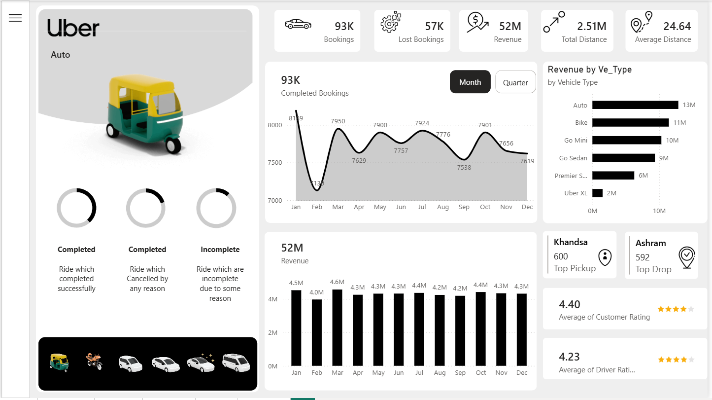

# Uber Ride Analytics Dashboard

A Power BI dashboard analyzing 150,000 Uber ride bookings across 6 report pages — booking performance, revenue, vehicle mix, rider behavior, and location/demand patterns.

### Overview

Completed/Lost bookings, revenue, total & average distance...

## Dataset

Public dataset: [Uber Ride Analytics 2024 (Kaggle)](https://www.kaggle.com/datasets/yashdevladdha/uber-ride-analytics-dashboard), 150,000 synthetic ride records for Delhi/NCR. **Not real Uber data** — treat this as a portfolio/analytics exercise, not a production BI system.

19 columns: booking ID, status, timestamp, customer ID, vehicle type, pickup/drop location, cancellation reasons (customer & driver), incomplete ride reasons, booking value, ride distance, driver/customer ratings, payment method.

## What's in this repo

| File | Description |
|---|---|
| `Uber-Dashboard.pbix` | Power BI report — 6 pages, 180 visuals |
| `uber.xlsx` | Source dataset |
| `business_requirements.md` | Requirements doc used to scope the build |

## Report pages

**Home** — navigation landing page.

**Overview** — Completed/Cancelled/Lost bookings, revenue, total & average distance, monthly and quarterly trends, revenue by vehicle type, top pickup/drop locations, average rider & driver ratings. Filterable by vehicle type.

**Vehicle** — booking count, revenue, and revenue contribution by vehicle type, filterable by month, time slot, payment method, and pickup/drop location.

**Revenue** — revenue broken down by customer, vehicle type, payment method, and month/quarter.

**Rider** — cancellation reasons, payment method mix, monthly/quarterly trends, and a detail table segmenting first-time, returning, and regular riders.

**Location** — monthly distance by location, distance by vehicle type, busiest time slots, busiest pickup/drop areas.

## Build notes

- Data cleaned and shaped in Power Query.
- Star-schema-style model with DAX measures for the KPIs above (completed/cancelled/lost booking counts, revenue, average distance, average ratings).
- Bookmark-based navigation between pages; slicer panel for cross-filtering.

## Business questions this answers

- Which vehicle type generates the most revenue, and which locations drive the most demand?
- When do bookings peak (time slot / day / month)?
- What's the split between first-time, returning, and regular riders?
- What are the leading cancellation reasons, on the customer side and the driver side?
- Which payment methods dominate, and does that vary by vehicle type?

## Known limitations

- Synthetic dataset — patterns (e.g. cancellation reasons, ratings distribution) are generated, not observed. Don't cite absolute numbers from this as real-world Uber behavior.
- No live/API data connection — this is a static snapshot, not a refreshing pipeline.
- Built to a self-authored requirements doc rather than a live stakeholder brief.

## Tools

Power BI Desktop · Power Query · DAX
